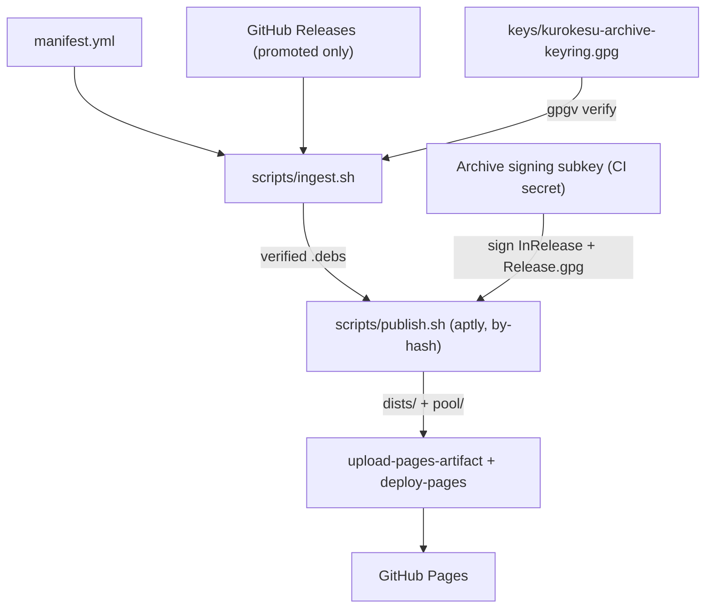

# apt

Kurokesu APT package archive: signed Debian/Ubuntu packages for Kurokesu camera software.

This repository builds and serves an `apt` archive (via GitHub Pages) from GitHub Releases of Kurokesu source repositories.

## Pipeline

The archive is a stateless, single-writer republisher: every run rebuilds the full index from `manifest.yml` and verified release assets.

## Adding or updating a release

Releases are added manually. Add one block per distinct source tag to `releases:` in `manifest.yml`. Filenames are derived, so you only supply `source`, `tag`, and `version` (and optionally `suites`).

Sources ship one tarball per suite and architecture by default. A source marked `tarball: single` (DKMS packages, arch:all) ships one suite-independent tarball that is served to every suite.

Packaging rebuilds reuse the source tag and clobber its assets, so on a rebuild **edit the existing block's `version` in place (`-1` -> `-2`) and never append a second block** for the same tag. Because a rebuild lands on an already-promoted release, validate the rebuilt assets before bumping the version.

Then trigger `publish.yml` workflow manually (Actions -> Run workflow). Each run is a full rebuild from the manifest, so to roll back a bad release just `git revert` the manifest change and re-run.

## License

GPL-3.0 covers this repository's tooling only. The served `.deb`s retain their upstream licenses.
